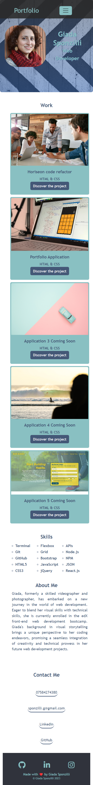

# giada-sponzilli-bootstrap-portfolio

## Description

This portfolio wants to showcase my skills as a web developer to future employers.
In this application, I rebuilt my previous portfolio using Bootstrap 5.
The website is a skeleton for my future projects. Currently, I have only two coding projects.
The resume button is linked to a google doc.
At the bottom of the page there is a section with my contacts to make it easier for employers who wish to reach out for possible interviews.
The website has been made using bootrstrap 5, flexboxes, variables and pseudo-classes.

The code is deployed at https://giadasponzilli.github.io/giada-sponzilli-bootstrap-portfolio/

## Screenshots

## Installation

N/A

## Usage

This application can be used by employers to take a look at my skills and projects as a web developer.

## Credits

I used Font Awesome for social icons https://fontawesome.com/

N/A

## License

MIT License

## Badges

 

